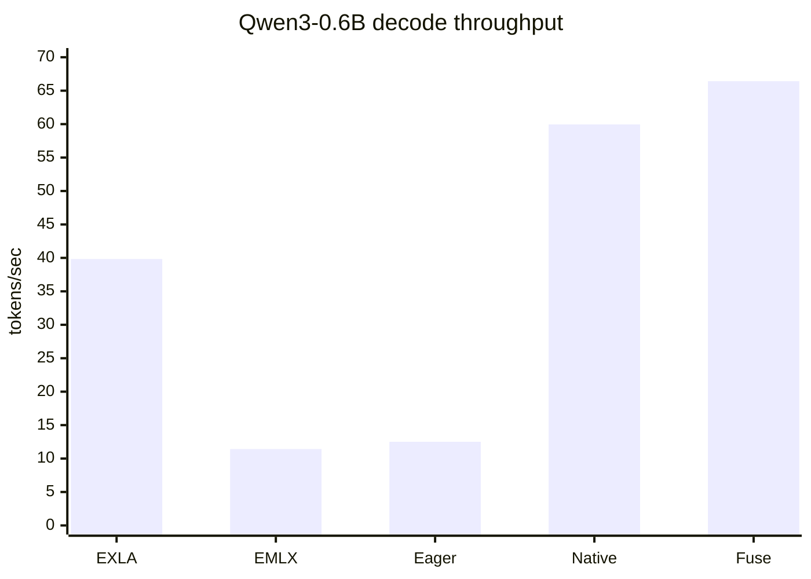
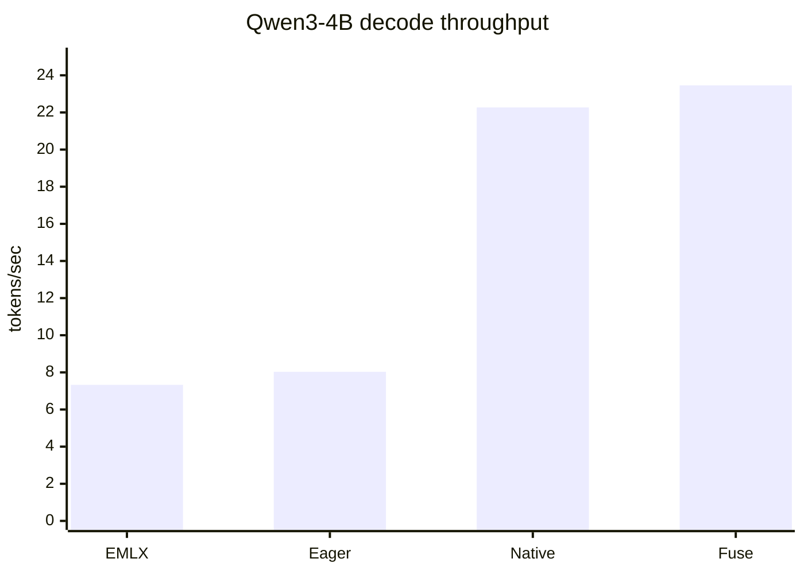
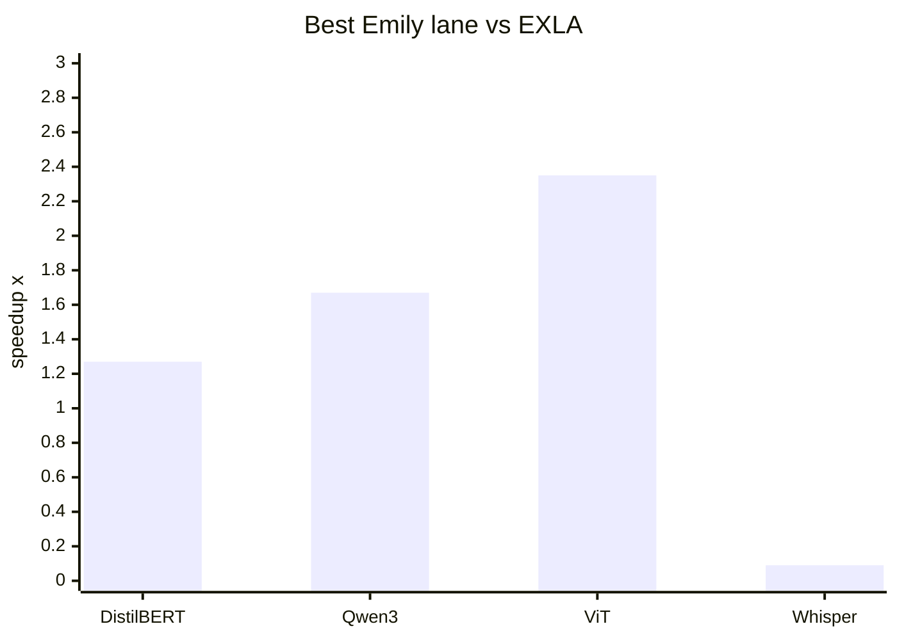
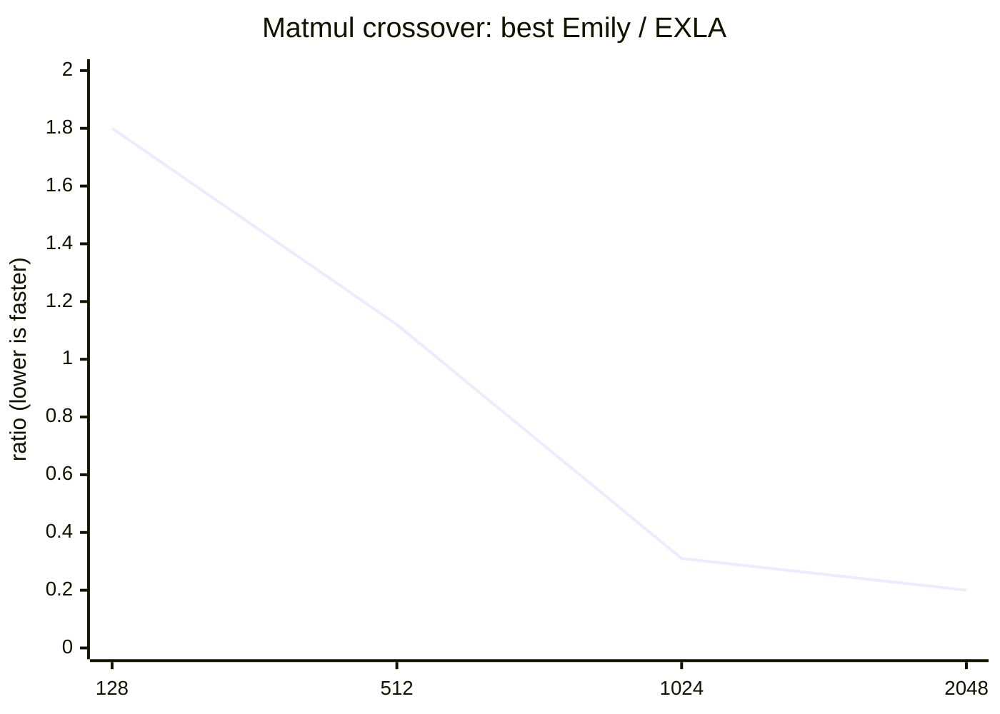

# Emily vs EMLX vs EXLA - performance comparison

This report compares Emily against two Nx backend baselines:

* **EXLA**: XLA host/CPU backend on Apple Silicon.
* **EMLX**: older MLX-backed Nx backend on the Metal GPU.
* **Emily**: local MLX/Metal backend, reported across eager, native, and fuse
  lanes. For conclusions, use the best Emily lane for the workload.

Harness: `bench/emily_vs_exla.exs`. Raw generated numbers:
[`bench/emily_vs_exla_results.md`](emily_vs_exla_results.md). Large-model
GPU-focused addendum: `bench/qwen3_4b_emily_vs_emlx.exs`.

## Performance overview

The main benchmark suite runs five lanes in every tier: `exla`, `emlx`,
`emily-eager`, `emily-native`, and `emily-fuse`.

Those lanes provide two complementary baselines:

| Baseline | Question answered |
| --- | --- |
| EXLA CPU | Is MLX/Metal GPU faster than XLA host CPU for this workload? |
| EMLX GPU | Is Emily's compiler/runtime faster than the older MLX-backed Nx stack? |

The focused Qwen3-4B script includes an EXLA lane for explicit experiments, but
its default run is GPU-only. On this 24 GB M4 Pro, Qwen3-4B bf16 on EXLA-CPU was
killed by the OS during compile/run. The completed, canonical three-way Qwen
comparison is therefore Qwen3-0.6B in the main suite.

## Environment

Fresh run: 2026-06-13 12:24, Apple M4 Pro MacBook Pro with 24 GB RAM.

| Component | Version / backend |
| --- | --- |
| Elixir / OTP | 1.19.5 / 28 |
| Nx | 0.12.1 |
| Emily | 0.6.1 local checkout |
| EMLX | 0.3.1, Metal GPU |
| EXLA | 0.12.0, host CPU client |

## Executive summary

Emily's best lane wins the main model tiers that are GPU-friendly:

| Tier | EXLA | EMLX | Best Emily | Best lane | vs EXLA | vs EMLX |
| --- | ---: | ---: | ---: | --- | ---: | ---: |
| DistilBERT QA | 8.99 ms | 19.19 ms | 7.06 ms | native | 1.27x faster | 2.72x faster |
| Qwen3-0.6B decode | 39.84 tok/s | 11.42 tok/s | 66.42 tok/s | fuse | 1.67x faster | 5.82x faster |
| ViT-base image classification | 56.19 ms | ERR | 23.93 ms | native | 2.35x faster | n/a |
| Whisper-tiny transcription | 88.49 ms | ERR | 961.68 ms | native | 10.9x slower | n/a |

The Qwen3-4B addendum shows the qualitative Emily-vs-EMLX difference clearly on
the largest practical Bumblebee model for this machine:

| Lane | Qwen3-4B tok/s | vs EMLX |
| --- | ---: | ---: |
| EMLX | 7.33 | 1.00x |
| Emily eager | 8.03 | 1.10x |
| Emily native | 22.27 | 3.04x |
| Emily fuse | 23.46 | 3.20x |

So the headline is: **Emily's compiler path is the differentiator.** Eager is
roughly EMLX-like on Qwen3-4B; native/fuse are about 3.2x faster.

## Visual summary









## Tier 1 - op microbenchmarks

The op tier is still a latency/throughput crossover story. EXLA CPU wins the
small launch-bound cases, while MLX/Metal wins once the tensors are large enough
to amortize dispatch and kernel launch overhead.

Examples from the fresh run:

| Op | Size | Winner | Signal |
| --- | ---: | --- | --- |
| add | 256 | EXLA | best Emily is 2.28x slower than EXLA |
| add | 4096 | Emily | best Emily is 2.0x faster than EXLA |
| exp | 4096 | Emily | best Emily is 3.2x faster than EXLA |
| softmax | 4096 | Emily fuse | best Emily is 2.4x faster than EXLA and 1.29x faster than EMLX |
| matmul | 2048 | Emily/EMLX tie | both MLX lanes are about 5x faster than EXLA |

Against EMLX, Emily's best op lane is usually close: sometimes a little faster,
sometimes a little slower. The bigger EMLX-vs-Emily separation appears in traced
model execution, especially Qwen decode, where Emily native/fuse avoid the
op-by-op execution shape.

## Tier 2 - DistilBERT QA

DistilBERT is a clean three-way win for Emily native:

| Lane | ms/call |
| --- | ---: |
| EXLA CPU | 8.99 |
| EMLX GPU | 19.19 |
| Emily eager | 16.45 |
| Emily native | 7.06 |
| Emily fuse | 8.50 |

Native is the right Emily option here. Fuse is not universally better; it helps
most when a compiled body is reused, such as decode loops.

## Tier 3 - Qwen3-0.6B decode

Qwen3-0.6B is the canonical completed three-way generation benchmark:

| Lane | tok/s |
| --- | ---: |
| EXLA CPU | 39.84 |
| EMLX GPU | 11.42 |
| Emily eager | 12.51 |
| Emily native | 59.96 |
| Emily fuse | 66.42 |

This is the clearest main-suite result. Emily eager is near EMLX, while
native/fuse jump far ahead. Fuse is the best choice for decode loops.

## Tier 4 - ViT-base image classification

ViT-base strongly favors Emily native:

| Lane | ms/call |
| --- | ---: |
| EXLA CPU | 56.19 |
| EMLX GPU | ERR |
| Emily eager | 38.78 |
| Emily native | 23.93 |
| Emily fuse | 27.50 |

This tier is GPU-friendly: larger matrix multiplies and enough work per forward
for the GPU path to dominate. The EMLX lane did not complete in this harness, so
the meaningful comparison here is Emily vs EXLA.

## Tier 5 - Whisper-tiny transcription

Whisper-tiny remains Emily's bad case:

| Lane | ms/call |
| --- | ---: |
| EXLA CPU | 88.49 |
| EMLX GPU | ERR |
| Emily eager | 1815.80 |
| Emily native | 961.68 |
| Emily fuse | 981.89 |

This is not a coverage win for EXLA; the Emily lanes reported zero fallbacks in
the live run. It is a workload-shape problem: Whisper-tiny is made of many small
kernels where CPU launch overhead and cache locality beat GPU dispatch. Native
cuts eager roughly in half, but still cannot remove the underlying small-kernel
cost. Fuse does not help this workload.

## Qwen3-4B addendum

The focused Qwen3-4B script was rerun after the three-way reorganization. Its
safe default remains GPU-only:

```sh
elixir bench/qwen3_4b_emily_vs_emlx.exs
```

Fresh result:

| Lane | mean tok/s | min | max | vs EMLX |
| --- | ---: | ---: | ---: | ---: |
| EMLX | 7.33 | 7.31 | 7.37 | 1.00x |
| Emily eager | 8.03 | 7.98 | 8.08 | 1.10x |
| Emily native | 22.27 | 22.16 | 22.32 | 3.04x |
| Emily fuse | 23.46 | 23.35 | 23.58 | 3.20x |

An explicit EXLA smoke attempt on Qwen3-4B:

```sh
EMILY_BENCH_NEW_TOKENS=4 EMILY_BENCH_RUNS=1 EMILY_BENCH_WARMUP=0 \
  EMILY_BENCH_LANES=exla,emlx,emily-fuse \
  elixir bench/qwen3_4b_emily_vs_emlx.exs
```

loaded Qwen3-4B on `EXLA.Backend` as `:bf16`, then the process was killed with
exit 137 during the EXLA compile/run. That is why the default 4B addendum is not
used as the canonical three-way comparison on this 24 GB machine.

## Recommendations

Use `emily-fuse` for autoregressive decode loops. It is best on Qwen3-0.6B and
Qwen3-4B because the loop body is reused.

Use `emily-native` as the default best Emily lane for single-forward model
benchmarks. It wins DistilBERT and ViT here; fuse can be neutral or slower when
there is no repeated body to amortize.

Keep EXLA out of the default Qwen3-4B run on 24 GB machines. The EXLA 4B smoke
was killed by the OS, while Qwen3-0.6B gives a completed three-way generation
comparison.

Investigate Whisper separately with profiler traces. The model lowers, but its
small-kernel shape is hostile to the current GPU path.
